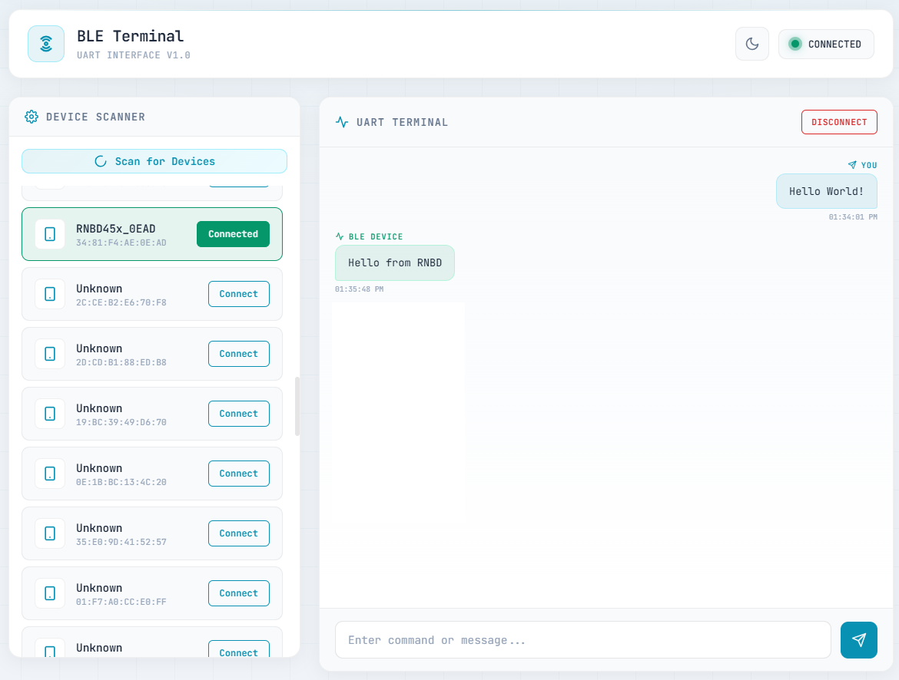
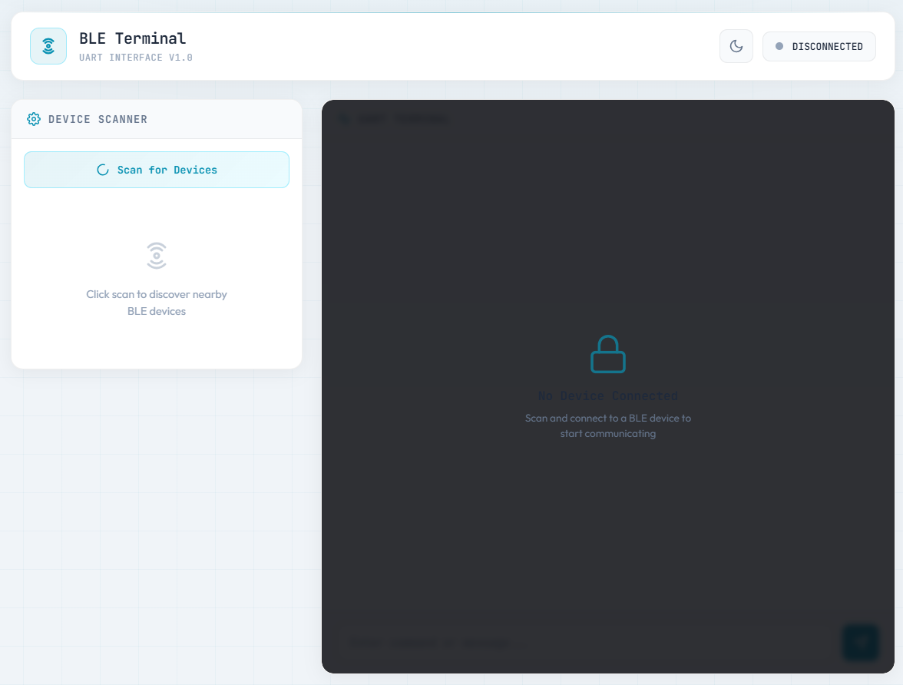
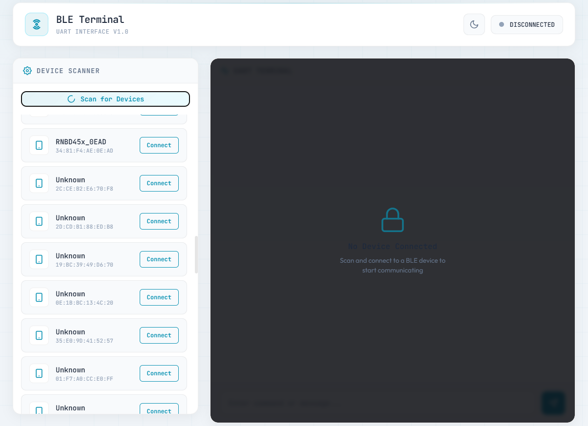

# BLE Terminal - UART Interface

A web-based Bluetooth Low Energy (BLE) terminal application for communicating with BLE devices using Transparent UART.


---

## What is Transparent UART?

Transparent UART (also known as Serial-over-BLE or UART Pass-through) is a wireless communication method that creates a virtual serial port connection over Bluetooth Low Energy. It allows seamless, bidirectional data transfer between a BLE device and a host system, just like a traditional wired UART connection.

### How Transparent UART Works

```
+------------------+                              +------------------+
|   HOST DEVICE    |                              |   BLE DEVICE     |
|   (This App)     |          BLE Link            |   (MCU/Sensor)   |
|                  |                              |                  |
|  +-----------+   |    +------------------+      |   +-----------+  |
|  |  Web App  |<--|--->|  Transparent     |<---->|   |Transparent|  |
|  |  Terminal |   |    |  UART Service    |      |   |  Service  |  |
|  +-----------+   |    +------------------+      |   +-----------+  |
|                  |                              |                  |
+------------------+                              +------------------+
```

### Key Concepts

| Term | Description |
|------|-------------|
| **Transparent** | Data passes through without modification - what you send is exactly what the device receives |
| **TX (Transmit)** | Data sent FROM the BLE device TO this application (notifications) |
| **RX (Receive)** | Data sent FROM this application TO the BLE device (write operations) |
| **Service UUID** | Identifies the UART service on the BLE device |
| **Characteristic UUID** | Identifies specific data channels (TX/RX) within the service |

### Data Flow

**Sending data (App to Device):**
```
[Web Terminal] --> [Flask Server] --> [BLE Manager] --> [RX Characteristic] --> [BLE Device]
     |                   |                  |                   |
   User types       WebSocket           Bleak write         GATT Write
   message          event               operation           to device
```

**Receiving data (Device to App):**
```
[BLE Device] --> [TX Characteristic] --> [BLE Manager] --> [Flask Server] --> [Web Terminal]
     |                   |                    |                  |
  Device sends       GATT Notify         Notification       WebSocket
  response           enabled             callback           broadcast
```

### Why Use Transparent UART?

| Advantage | Description |
|-----------|-------------|
| **Wireless Freedom** | No physical cable connection required |
| **Simple Protocol** | No complex handshaking - just send and receive bytes |
| **Universal** | Works with any device that supports the UART service |
| **Low Power** | BLE is designed for battery-powered devices |
| **Cross-Platform** | Works on Windows, macOS, and Linux |

### Common Use Cases

- **Debugging embedded systems** - Send AT commands, view logs
- **Sensor data collection** - Receive readings from IoT devices
- **Device configuration** - Update settings on microcontrollers
- **Firmware updates** - Transfer data to BLE-enabled devices
- **Remote control** - Send commands to robots, drones, or other devices

### Compatible Devices

This application works with BLE devices that implement the Transparent UART service, including:

- Any BLE 5.0 or above device using the Microchip Transparent UART profile

---

## Features

- Scan and discover nearby BLE devices
- Connect to BLE devices with UART service
- Send and receive messages via BLE UART
- Real-time communication using WebSockets
- Dark/Light theme support
- Toast notifications for status updates

## Requirements

- Python 3.8 or higher
- Bluetooth adapter on your computer
- BLE device with UART service (UUID: `49535343-FE7D-4AE5-8FA9-9FAFD205E455`)

## Installation

### 1. Clone or download the project

```bash
cd webapp
```

### 2. Create a virtual environment (recommended, can be skipped)

```bash
python -m venv venv
```

Activate the virtual environment:

**Windows:**
```bash
venv\Scripts\activate
```

**macOS/Linux:**
```bash
source venv/bin/activate
```

### 3. Install dependencies using requirements.txt

```bash
pip install -r requirements.txt
```

This will install:
- `flask` - Web framework
- `flask-socketio` - WebSocket support for real-time communication
- `bleak` - Bluetooth Low Energy library

## Running the Application

Start the application by running:

```bash
python app.py
```

The application will:
1. Start a Flask server on `http://localhost:5000`
2. Automatically open your default web browser

If the browser doesn't open automatically, navigate to `http://localhost:5000` manually.

---

## Application Guide

### Step 1: Initial Page

When you open the application, you'll see two main panels - the Device Scanner on the left and the UART Terminal on the right. The terminal is locked until you connect to a device.



**Interface elements:**
- **Header**: Shows the app title, theme toggle button, and connection status
- **Device Scanner**: Panel to scan and select BLE devices
- **UART Terminal**: Locked panel showing "No Device Connected" message

Click the **"Scan for Devices"** button to discover nearby BLE devices. The scan takes about 5 seconds.

---

### Step 2: Scan Results

After scanning, discovered devices appear in a list. Each device shows its name (or "Unknown"), MAC address, and a Connect button.



**Device list features:**
- Device name and MAC address displayed for each device
- Click **"Connect"** next to your target device
- Re-scan anytime to refresh the device list

---

### Step 3: Connect and Send Messages

Once connected, the status indicator turns green showing **"CONNECTED"**, and the UART Terminal becomes active. You can now send messages to your BLE device.


**To send a message:**
1. Type your message in the input field at the bottom
2. Press **Enter** or click the **Send** button

**Message indicators:**
- **TX (sent)**: Messages you send to the BLE device (shown with send icon)
- Each message displays a timestamp

---

### Step 4: Receive Messages

Messages received from the BLE device appear in the terminal with a different indicator, allowing you to distinguish between sent and received data.


**Receiving data:**
- **RX (received)**: Messages from the BLE device (shown with pulse icon)
- Messages appear in real-time via BLE notifications
- All messages are timestamped for reference

**To disconnect:**
Click the **"Disconnect"** button in the terminal header to end the connection.

---

### Theme Toggle

Click the theme button (sun/moon icon) in the header to switch between dark and light modes. Your preference is saved in the browser.

---

## Toast Notifications

The application shows toast notifications for various events:

| Notification | Meaning |
|-------------|---------|
| "Scanning for BLE devices..." | Scan started |
| "Found X devices" | Scan completed successfully |
| "No devices found" | Scan completed with no results |
| "Connecting to device..." | Connection attempt started |
| "Connected successfully!" | Device connected |
| "Connection failed: ..." | Connection error |
| "Disconnected from device" | Device disconnected |

---

## Troubleshooting

### No devices found
- Ensure your BLE device is powered on and advertising
- Make sure Bluetooth is enabled on your computer
- Try moving closer to the BLE device

### Connection failed
- Verify the device has the required UART service
- Check if the device is already connected to another application
- Restart the BLE device and try again

### Messages not sending/receiving
- Check the connection status indicator
- Verify the correct TX/RX UUIDs match your device
- Check the terminal/console for error messages

---

## Technical Details

### BLE UUIDs

| UUID | Description |
|------|-------------|
| `49535343-FE7D-4AE5-8FA9-9FAFD205E455` | UART Service |
| `49535343-1E4D-4BD9-BA61-23C647249616` | TX Characteristic (notify) |
| `49535343-8841-43F4-A8D4-ECBE34729BB3` | RX Characteristic (write) |

### Server Configuration

- Host: `0.0.0.0` (accessible from network)
- Port: `5000`
- WebSocket: Socket.IO with threading mode

### Transparent UART Message Format

This application uses a simple text-based protocol:

**Outgoing messages (to BLE device):**
```
<message>\r\n
```
- Messages are encoded as UTF-8
- Each message is terminated with `\r\n` (carriage return + line feed)

**Incoming messages (from BLE device):**
```
<raw bytes> --> UTF-8 decode --> Display in terminal
```
- Raw bytes are decoded as UTF-8
- Invalid characters are ignored (errors="ignore")
- Messages appear in real-time via BLE notifications

### Microchip Transparent UART Profile

This application uses the Microchip Transparent UART profile, which is widely supported:

```
Service: 49535343-FE7D-4AE5-8FA9-9FAFD205E455
    |
    +-- TX Characteristic: 49535343-1E4D-4BD9-BA61-23C647249616
    |   Properties: Notify
    |   Direction: Device --> App (receive data)
    |
    +-- RX Characteristic: 49535343-8841-43F4-A8D4-ECBE34729BB3
        Properties: Write, Write Without Response
        Direction: App --> Device (send data)
```

**Note:** The naming convention (TX/RX) is from the BLE device's perspective:
- **TX** = Device transmits TO the app (we receive notifications)
- **RX** = Device receives FROM the app (we write to this characteristic)
